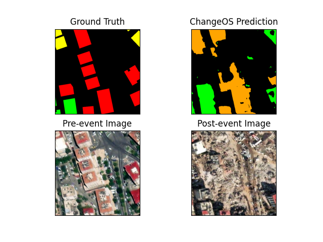

<h1 align="center"> Evaluating Deep Learning based Building Damage Assessment Methods in earthquake-affected, densely built-up urban areas: The case of Kahramanmaraş </h1>  

 Repository for the master thesis for the degree of Master of Data Science for Public Policy

## Table of Contents

- [Abstract](#Abstract)
- [Overview](#Overview)
- [Data](#Data)
- [xView-baseline](#xView2-baseline)
- [ChangeOS](#ChangeOS)
- [MS4D-Net](#MS4D-Net)

## Abstract

In post-disaster settings, damage assessments need to be conducted fast and reliably. To this end, deep learning approaches for building damage assessment have been researched and various models have been developed. However, the real-world performance on off-nadir post-event imagery of earthquakes in densely built-up urban areas still remains underexplored. In this analysis, a dataset for Kahramanmaraş, a Turkish city affected by the 2023 earthquake in the East Anatolian Fault Zone is created by combining open-source building footprints, emergency mapping information, and high-resolution open satellite imagery. Three different approaches are tested against the dataset: the [xView2-baseline](https://github.com/DIUx-xView/xView2_baseline) damage classification model component, combined with open-source building footprints as localization, the Multitask-Based Semi-Supervised Semantic Segmentation Framework [MS4D-Net](https://github.com/YJ-He/MS4D-Net-Building-Damage-Assessment), and the deep object-based semantic change detection framework [ChangeOS](https://github.com/Z-Zheng/ChangeOS). The findings suggest that earthquake building damage in densely built-up urban setting poses significant challenges for model performance. The ChangeOS framework outperforms the other approaches, although robustness checks indicate that the model does not reliably predict the same damage scene on different imagery.

## Overview

The project relies on one main data preparation pipeline that was used to create the main dataset for Kahramanmaraş. The data pipeline brings together OpenStreetMap building footprints, EU Copernicus EMS building damage information and satellite data from the Maxar Open Data Program. Next to this, a subset of the xBD dataset is used to train the supervised component of the MS4D-Net.

I used three separate enviornments for the experiments, which was neccessary because of the various dependencies, CUDA version, etc of the different models. The data preparation was conducted with a [pyhon 3.11 environment](environment.yml). For the MS4D-Net experiments, I used a [python 3.8 environment](src/models/MS4D-Net/environment.yaml). Finally, the xView2-baseline scripts were run on a Google colab notebook which was a [python 3.10 environment](assets/xView2-baseline/requirements.txt).

## Data

The pipeline starts with the retrieval of the satellite data from the Maxar Open Data Program. First, the [download links are retrieved](/src/data_prep/01_get_maxar_links.py), then starts the [retrieval of the iamgery](src/data_prep/02_download_tifs.py). Then, Building footprints are triangulated with the building damage information form the Copernicus EMS for Kahramanmaraş, [see this script for reference](src/data_prep/03_prep_building_footprints.py). To perform these steps, you can simply run the setup.sh script from the command line.

The final step in the processing pipeline prepares the satellite imadery (unifying the coordinate reference system, cropping out of irrelevant image parts, etc.), and overlays the pre and post-event satellite imagery, and the building footprints to create 512x512 image tiles for three combinations of pre and post-event satellite imagery. The segmentaiton masks are created in the same step. 

Finally, the xBD subset [(Gupta et al. 2019)](https://arxiv.org/abs/1911.09296) on the Mexcio City earthquake in 2017 is prepared. This data can be downloaded from the official [xView2 Challenge website](https://xview2.org/). The data is not directly compatible with the MS4D-Net model that is used to assess it. Therefore, a slightly adapted version of a script from the [Microsoft Damage Assessment Model](https://github.com/microsoft/building-damage-assessment-cnn-siamese) is used to convert the json masks to png files that can be used as segmenation masks. Another [short script](src/utils/create_tif_patches.py) is then used to split up the images and masks into 512x512 files.

## xView2-baseline

Among the models that are used to for the analysis is the xView2-baseline model. The training notebook relies in large parts on the training code from the [original repository](https://github.com/DIUx-xView/xView2_baseline).

## ChangeOS

Another model that was tested is the [ChangeOS model](https://github.com/Z-Zheng/ChangeOS). The official implementation from the original paper [(Zhen et al. 2020)](https://www.sciencedirect.com/science/article/abs/pii/S0034425721003564) was used. 

 
 ## MS4D-Net 
 Finally, I use the MS4D-Net by [He et al. (2023)](https://www.mdpi.com/2072-4292/15/2/478) which is a semi-supervised learning framework. Here, I reused large parts of the original [codebase](https://github.com/YJ-He/MS4D-Net-Building-Damage-Assessment).
